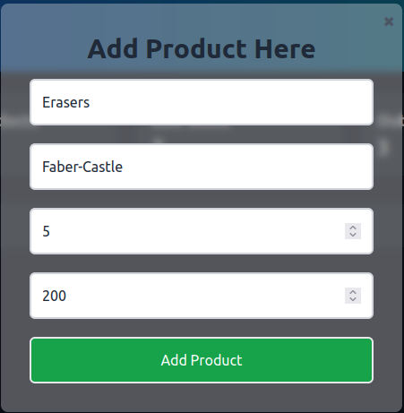
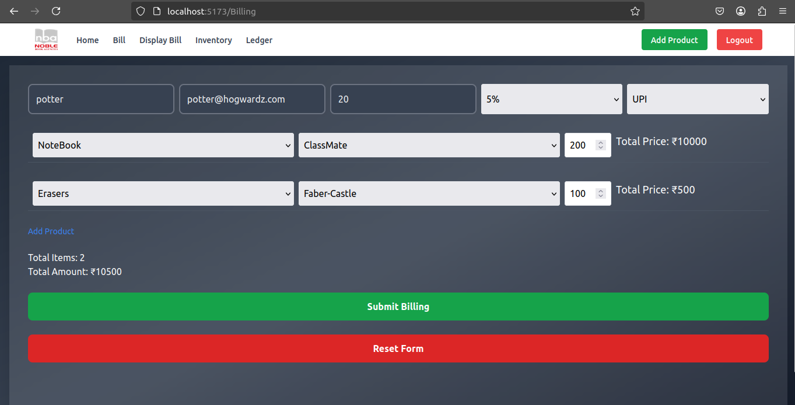

# 🛍️ Stationary Management App (MERN Stack)

A web-based application designed for stationary shop owners to manage their products, generate bills, print invoices, and track stock. Built with the **MERN** stack to provide a smooth and efficient experience for small business owners.

## 📸 Screenshots

### 📊 Demo

### 🏠 Inventory

### ➕ Add Products

### 🧾 Create Bill

## 🚀 Features

- 📦 Add New Products
- 🧾 Add Bills
- 🖨️ Print Generated Bills
- 📊 View & Manage Stock
- 📝 Easy-to-use UI for day-to-day operations

## 🧑‍💻 Tech Stack

**Frontend**  

**Backend**  

## 📂 Repositories

- **Frontend**: [stationary-frontend](https://github.com/NumairFaizi/stationery)
- **Backend**: [stationary-backend](https://github.com/NumairFaizi/stat-backend)

## 👨‍💻 Contributors
- **Backend Developer:** [Mohammed Hassan](https://www.linkedin.com/in/mohammed-hassan-343b00215)
- **Frontend Developer:** [Faizi Numair](https://www.linkedin.com/in/faizi-numair-mohammed-hesham-shahid-akhtar-42668b1b9)
